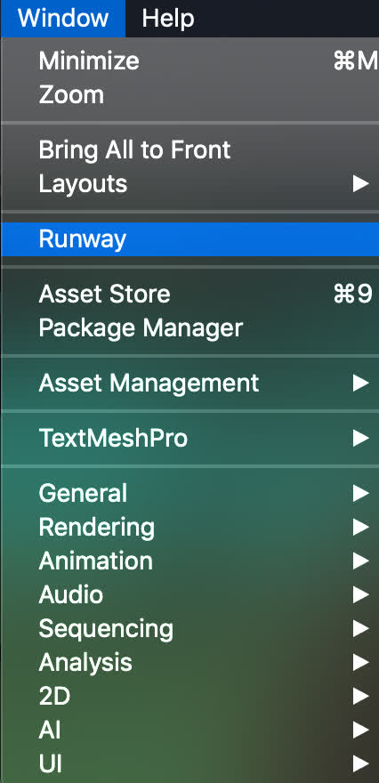

# Runway for Unity

Generate images, process textures, and create new rendering pipelines using [Runway](https://runwayml.com) machine learning models inside Unity.

### Prerequisites

* Download the latest release of [Runway](https://runwayml.com/download) and sign up for an account. Visit our [installation guide](https://learn.runwayml.com/#/getting-started/installation) for more details. If you encounnter any issues, then reach out to us through the  [support page](https://support.runwayml.com).
* [Unity](https://unity3d.com/get-unity). Unity version 2019.2.3f1 or greater is required.

### Installation

There are two ways to use the Runway for Unity plugin.

* [Download the starter project](https://github.com/runwayml/unity-plugin/archive/master.zip), containing a simple scene to get you started as quickly as possible with Runway for Unity.

* Import the Runway for Unity scripts to your project. The latest `RunwayForUnity_{version}.unitypackage` is available in the [releases](https://github.com/runwayml/unity-plugin/releases) page. The `.unitypackage` contains the necessary scripts in order to use Runway models in Unity.

### Getting Started

First, you need to first launch the Runway application and sign in with your account.

[Download and unzip the Runway for Unity project](https://github.com/runwayml/unity-plugin/archive/master.zip). Import the project to Unity by opening Unity Hub and clicking on the `ADD` button next to `Projects` and selecting your project folder.

Once the project has been imported, click on the newly added project to launch the Unity Editor.

#### Using the Runway Panel

The sample project contains functionality related to running models and performing inference using Runway, as well as a sample scene to let you quickly explore the output of different Runway models. To interact with Runway inside Unity, you first need to open the Runway panel inside Unity. Click `Window` on the top menu and then `Runway` to open the Runway panel.

The Runway panel is split into four sections: the **(1) Model Selection**, **(2) Input**, **(3) Output**, and **(4) Run Options**.

> Note: If you are seeing a `RUNWAY NOT FOUND` message instead of the sections above, ensure that the Runway application is running and that you are signed in.

#### Model Selection

Here, you can select the Runway model that you'd like to use. To learn more about the capabilities of different models in Runway, [watch our tutorial on discovering Runway models](https://www.youtube.com/watch?v=ePIRExcanjg).

### Contributing

This is still a work in progress. Contributions are welcomed!
